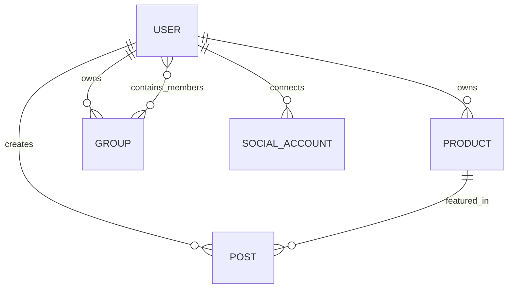

# Marketing Hub Database Schemas

This document outlines the MongoDB database schemas for the Marketing Hub application, using Mongoose-like syntax.

## Entity Relationship Diagram



---

## Schemas

### 1. User Schema
Represents the users of the system (Senders and Posters).

| Field | Type | Description |
| :--- | :--- | :--- |
| `username` | String | Unique username for login. |
| `email` | String | Unique email address. |
| `password` | String | Hashed password. |
| `role` | String | Role of the user: `Sender` or `Poster`. |
| `createdAt` | Date | Timestamp when the user was created. |
| `updatedAt` | Date | Timestamp when the user was last updated. |

**Mongoose Definition:**
```javascript
const UserSchema = new Schema({
  username: { type: String, required: true, unique: true, trim: true },
  email: { type: String, required: true, unique: true, lowercase: true },
  password: { type: String, required: true },
  role: { type: String, enum: ['Sender', 'Poster'], required: true },
}, { timestamps: true });
```

### 2. Product Schema
Represents products managed by Senders.

| Field | Type | Description |
| :--- | :--- | :--- |
| `name` | String | Name of the product. |
| `description` | String | Detailed description. |
| `imageUrl` | String | URL to the product image. |
| `inStock` | Boolean | Availability status. |
| `ownerId` | ObjectId | Reference to the `User` (Sender) who owns the product. |
| `createdAt` | Date | Timestamp. |
| `updatedAt` | Date | Timestamp. |

**Mongoose Definition:**
```javascript
const ProductSchema = new Schema({
  name: { type: String, required: true },
  description: { type: String },
  imageUrl: { type: String },
  inStock: { type: Boolean, default: true },
  ownerId: { type: Schema.Types.ObjectId, ref: 'User', required: true },
}, { timestamps: true });
```

### 3. Post Schema
Represents marketing posts created by Senders to promote products.

| Field | Type | Description |
| :--- | :--- | :--- |
| `content` | String | The text content of the post. |
| `photoUrls` | [String] | List of URLs for photos attached to the post. |
| `productId` | ObjectId | Reference to the associated `Product`. |
| `creatorId` | ObjectId | Reference to the `User` (Sender) who created the post. |
| `createdAt` | Date | Timestamp. |
| `updatedAt` | Date | Timestamp. |

**Mongoose Definition:**
```javascript
const PostSchema = new Schema({
  content: { type: String, required: true },
  photoUrls: [{ type: String }],
  productId: { type: Schema.Types.ObjectId, ref: 'Product', required: true },
  creatorId: { type: Schema.Types.ObjectId, ref: 'User', required: true },
}, { timestamps: true });
```

### 4. Group Schema
Represents a collaboration group where Posters can join via an invitation code.

| Field | Type | Description |
| :--- | :--- | :--- |
| `name` | String | Name of the group. |
| `inviteCode` | String | Unique code for joining the group. |
| `ownerId` | ObjectId | Reference to the `User` (Sender) who owns the group. |
| `memberIds` | [ObjectId] | List of references to `User` (Poster) members. |
| `createdAt` | Date | Timestamp. |
| `updatedAt` | Date | Timestamp. |

**Mongoose Definition:**
```javascript
const GroupSchema = new Schema({
  name: { type: String, required: true },
  inviteCode: { type: String, required: true, unique: true },
  ownerId: { type: Schema.Types.ObjectId, ref: 'User', required: true },
  memberIds: [{ type: Schema.Types.ObjectId, ref: 'User' }],
}, { timestamps: true });
```

### 5. SocialAccount Schema
Represents social media connections for Posters.

| Field | Type | Description |
| :--- | :--- | :--- |
| `userId` | ObjectId | Reference to the `User` (Poster). |
| `platform` | String | Social platform: `Facebook`, `Zalo`, or `TikTok`. |
| `credentials` | Mixed | Generic object storing access tokens and platform-specific data. |
| `status` | String | Status of the connection: `active`, `expired`, or `disconnected`. |
| `createdAt` | Date | Timestamp. |
| `updatedAt` | Date | Timestamp. |

**Mongoose Definition:**
```javascript
const SocialAccountSchema = new Schema({
  userId: { type: Schema.Types.ObjectId, ref: 'User', required: true },
  platform: { type: String, enum: ['Facebook', 'Zalo', 'TikTok'], required: true },
  credentials: { type: Schema.Types.Mixed },
  status: { type: String, enum: ['active', 'expired', 'disconnected'], default: 'active' },
}, { timestamps: true });
```

---

## Relationships Summary

- **User & Product**: A `User` (Sender) can own multiple `Product` entries.
- **Product & Post**: A `Product` can be featured in multiple `Post` entries.
- **User & Post**: A `User` (Sender) can create multiple `Post` entries.
- **User & Group (Owner)**: A `User` (Sender) can own multiple `Group` entries.
- **User & Group (Member)**: A `User` (Poster) can be a member of multiple `Group` entries.
- **User & SocialAccount**: A `User` (Poster) can link multiple `SocialAccount` entries (one per platform or multiple for different profiles).

## Indexing Recommendations

- `User`: Index on `username` and `email` (unique).
- `Product`: Index on `ownerId` for fast lookup of a Sender's products.
- `Post`: Index on `productId` and `creatorId`.
- `Group`: Index on `inviteCode` (unique) and `ownerId`.
- `SocialAccount`: Index on `userId` and `platform`.
